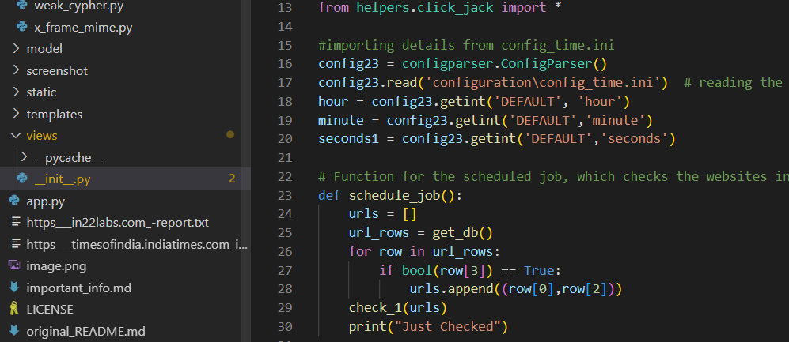
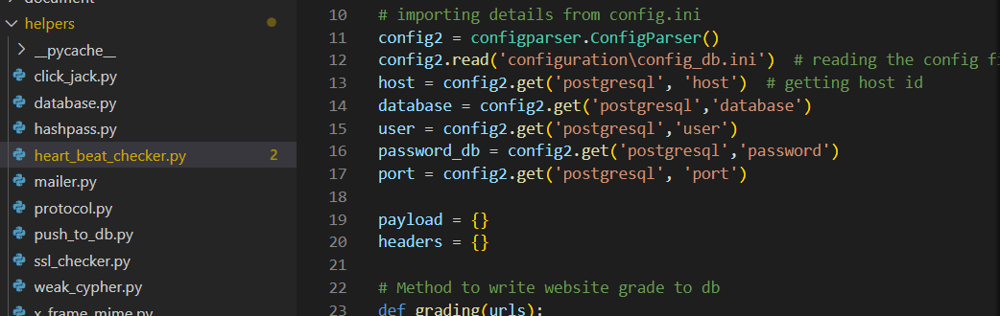
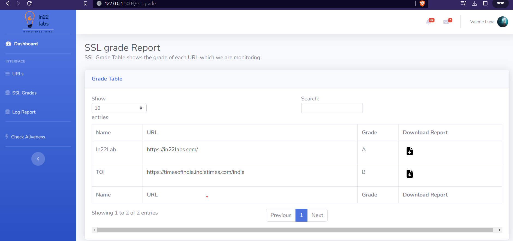

# How To run the project

* Make sure that you have python version above "3.8" and "pip" updated.
* You have Postgres DB for storing the website logs
* You have mongodb for doing user login. (Since the original project from which this is developed uses MongoDB as user login db I haven't changed it.)

You can change the db configurations by going into `configuration` folder, there in `__init__.py` you can change mongodb credentials and in `config_db.ini`you can change the postgres credentials.

`config_mail.ini` - Contains the Mailing credentials which you need to change.

`config_time.ini` - Contains the scheduler time configurations details which we can change based on how frequently we want to check the aliveness.

If your system is not able to read the `.ini` files you have to change those manually by going into specific `.py` files.

To change the time for how frequently the app should check the websites go to `views>__init__.py` and change the following variables to integer values and comment the lines 16 & 17

To change postgres db configs you have to go to `helpers>heart_beat_checker.py` and `helpers>push_to_db.py` and comment the line 11 & 12 change the following `host(string), database(string), user(string), passwprd_db(string), port(int)`

**Note:** Don't change the variable names only change the values.

  

Now let's come to running the project 
## First create a virtutal environment using the below command

`python3 -m venv "name-of-the-env" `

Then we have to activate the virtual env. If you are using windows use this command

`.\"name-of-the-env"\Scripts\Activate`

If you are using WSL or Ubuntu use this command

`"name-of-the-env"/bin/activate`

## Now install the requirements

Through this command

`pip3 install requirements.txt`

**Note:** If the above command is executed without error you can go to the next steps. Else if it is showing error you may have to change the versions of the packages inside requirements.txt manually.

## Run it

Now your project is ready to go run it through this command

`python3 app.py`

* Go to this URL to see the dashboard 

    `http://127.0.0.1:5003/` give this as the URL

# More details below:

# 
* ## "configuration" folder :

    It contains config files for postgres database , mongodb database , mailing credentials, scheduler time configuration

    `__init__.py` - Contains mongodb credentials which is used in the orginal project to store user login details. You have to change this with your mongodb server details.

    `config_db.ini` - Contains the Postgresql credentials which you need to change first.

    `config_mail.ini` - Contains the Mailing credentials which you need to change.

    `config_time.ini` - Contains the scheduler time configurations details which we can change based on how frequently we want to 

* ## "helpers" folder :

    ### From the original project : 

    `database.py` contains mongodb code for storing and retrieving user details.

    `hashpass.py` contains the code for hashing the user login password.

    `mailer.py` contains mailing functionality fo sending mail on successful login.

    ### For Heartbeat project :

    `heart_beat_checker.py` - It contains code to check the aliveness of the URLs and stores it in the postgres database. It also has `send_email` function which is used to send mail in case of website is down.

    `push_to_db.py` - Contains all the code for writing and fetching data from various tables of postgres.

    `ssl_checker.py` - Contains code for checking the SSL expiry date of URLs.

    `protocol.py` - Contains code for checking wheather the website supports HTTP1 protocol or HTTP2.

    `click_jack.py` - Contains code for checking if the website is vulnerable to click-jacking.

    `weak_cypher.py` - Contains code for checking the weak cyphers.

    `x_frame_mime.py` - Contains code for checking hsts, x-frame-options and mime.

    To download the report of tall this things you just have to click on the button shown in the image.

    

#

## "model" folder :

It contains code for Login and register and password checks.

#

## "views" folder :

The `__init__.py` file contains all the end points of flask which we are using to access various pages of our application.

#

## `app.py`

It contains  the code for initializing the flask application.

**Note:** To know about the original project you can read the `original_README.md`.